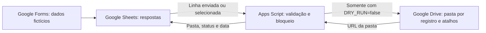

# Automação de admissões do RH — demonstração

[](https://github.com/leviroiz/rh-admission-automation-demo/actions/workflows/tests.yml)
[](LICENSE)

**Google Forms · Google Sheets · Google Apps Script · Google Drive**

Demonstração pública de organização de documentos de admissão: transforma respostas de uma planilha em pastas por registro e atalhos no Drive, com acompanhamento de status. **Demo sanitizada baseada na descrição de um processo real**, usando apenas registros fictícios.

Reconstruída para portfólio: **não é código de produção, não contém dados empresariais nem acesso aos sistemas da empresa**. Não há métricas de impacto presumidas nem vínculo oficial com uma empresa.

## Destaques técnicos

- **16 testes automatizados com serviços simulados** e CI com GitHub Actions.
- **Idempotência e retomada após falha parcial**: reaproveita pasta e atalhos, com registro estável e estrutura preservada.
- **Controle de concorrência** dentro do mesmo projeto Apps Script e sanitização de erros.
- **Simulação por padrão**, sem acessar o Drive; originais não são movidos, copiados ou excluídos.

**Validação real parcial realizada em ambiente Google com dados sintéticos.** Veja os [resultados aprovados e as pendências](docs/validacao-google.md); o gatilho Forms/Sheets permanece não executado, sem validação completa ponta a ponta ou prontidão para produção.

## Contexto e problema

Receber documentos por formulário e organizar manualmente pastas e links exige tarefas repetitivas e dificulta acompanhar o que já foi processado. O projeto demonstra como conectar as ferramentas do Google Workspace para centralizar essa organização, mantendo o registro de cada processamento na planilha.

## Solução e arquitetura



Em simulação, o Apps Script escreve apenas `SIMULADO` na planilha, sem acessar o Drive nem gerar link ou data novos. Em falhas, tenta registrar erro quando é seguro escrever; veja as limitações abaixo.

O script lê uma linha, valida o registro e o nome demonstrativo, encontra ou cria uma pasta pelo registro estável e organiza os documentos com **atalhos**. Os arquivos originais não são movidos, copiados nem excluídos. O nome é validado, mas não é usado no nome da pasta. A arquitetura e os cenários de falha estão em [docs/fluxo.md](docs/fluxo.md).

## Funcionalidades

- Execução manual da linha selecionada ou por gatilho de envio do formulário vinculado à planilha.
- Simulação habilitada por padrão: valida dados e escreve `SIMULADO`, sem acessar o Drive.
- Pasta individual com chave `DEMO-001`, independente do nome.
- Reexecução recuperável: reaproveita pasta e atalhos existentes por ID de destino.
- Bloqueio de concorrência dentro do mesmo projeto Apps Script.
- Rejeição de registros duplicados, cabeçalhos ambíguos e URLs não suportadas.
- Fórmulas proibidas em `Documentos`: `getFormulas()` detecta a fórmula mesmo quando o resultado calculado é uma URL válida ou vazio. Use URLs em texto simples.
- Registro de pasta, status e horário; erros genéricos sem gravar informações pessoais em logs.

## Estrutura

```text
src/Code.gs                 Implementação Google Apps Script
examples/respostas-demo.csv Registros inteiramente fictícios
examples/README.md          Entradas e saídas esperadas, incluindo recuperação
docs/fluxo.md               Fluxo, segurança e cenários de validação
docs/validacao-google.md    Validação real parcial, pendências e roteiro
tests/demo.test.cjs         Testes locais com serviços simulados
.github/workflows/tests.yml Testes em push e pull_request
.gitignore                 Exclusões preventivas
LICENSE                    Licença MIT para esta demonstração
```

## Configuração em um ambiente de teste

1. Crie uma planilha **nova e privada**, importe o CSV de `examples/` e nomeie a aba `Respostas Demo`. Os nomes de cabeçalho devem corresponder exatamente ao CSV. Colunas adicionais, como a data de envio do Forms, são permitidas.
2. Abra **Extensões → Apps Script**, copie `src/Code.gs` para `Code.gs` e salve. Não é necessário implantar um aplicativo web.
3. Nas configurações do projeto, adicione estas **propriedades do script**. Nunca publique seus valores reais:

   | Propriedade | Valor inicial |
   | --- | --- |
   | `SHEET_NAME` | `Respostas Demo` |
   | `ROOT_FOLDER_ID` | `COLE_ID_DA_PASTA_DE_TESTE` |
   | `DRY_RUN` | `true` |

4. Reabra a planilha, selecione a linha 2 e use **Admissoes Demo → Processar linha selecionada**. Autorize o script na conta de teste. O resultado esperado é `SIMULADO`; nenhuma pasta é criada.
5. Para exercitar o Drive, crie uma pasta **privada e exclusiva de teste em Meu Drive** e configure seu ID em `ROOT_FOLDER_ID`. Garanta que ela não herde compartilhamento público. Crie apenas arquivos sintéticos sem dados pessoais.
6. Opcionalmente, preencha `Documentos` com links desses arquivos separados por vírgula, ponto e vírgula ou quebra de linha. Formatos aceitos: `https://drive.google.com/file/d/COLE_ID_DO_ARQUIVO_DE_TESTE/view` (opcional `?usp=sharing`) ou `https://drive.google.com/open?id=COLE_ID_DO_ARQUIVO_DE_TESTE`. Placeholders não apontam para arquivos válidos: substitua-os **somente no ambiente de teste**, nunca no repositório.
7. Altere `DRY_RUN` para a string `false` e execute a mesma linha. Resultado esperado: pasta `DEMO-001`, atalhos opcionais, status `CONCLUIDO` e data. Execute novamente: a pasta e os atalhos devem ser reaproveitados.

### Integração com Google Forms

Crie um formulário de teste com perguntas `Registro`, `Nome ficticio` e `Documentos`. Use resposta curta para registro/nome e parágrafo com links de arquivos sintéticos para documentos (alternativa simples ao upload). Não colete e-mails nem documentos reais. Vincule suas respostas ao Google Sheets, use a aba de respostas efetivamente criada pelo Forms e atualize `SHEET_NAME` com esse nome no ambiente de teste. Não presuma que o Forms escreva na aba importada do CSV.

Adicione manualmente à direita da aba de respostas os cabeçalhos `Pasta`, `Status` e `Processado em`. No Apps Script **vinculado a essa planilha**, configure um gatilho instalável para `onFormSubmit`, origem **Da planilha**, evento **Ao enviar formulário**. O script usa `e.range`; não configure o gatilho no editor do Forms. Envie um novo registro único, por exemplo `DEMO-004` / `Pessoa Ficticia 004`.

Upload de arquivos no Forms pode ser usado em uma conta de teste que ofereça essa opção, desde que a célula resultante contenha os formatos de URL suportados e a conta executora tenha acesso aos arquivos. Esse caminho exige validação no ambiente Google. O gatilho executa com as permissões de quem o criou; mantenha somente um projeto e um gatilho para esta demonstração.

## Segurança e privacidade

Somente dados sintéticos devem ser usados. Nenhum arquivo, ID, URL privada, credencial, nome de candidato ou e-mail interno foi copiado do processo original. As propriedades do script ficam fora do código público, mas são visíveis aos editores do projeto: **não são um cofre de segredos**.

O código não altera permissões de compartilhamento, não envia e-mails, não usa serviços externos e não registra conteúdo de documentos. Os atalhos não concedem acesso ao arquivo de destino. Ainda assim, pasta, planilha e arquivos precisam de permissões restritas verificadas pelo operador. O escopo do serviço Drive é amplo: use uma conta dedicada sem arquivos reais. A validação de nomes fictícios é uma barreira didática, não um mecanismo que detecta ou anonimiza dados pessoais nos arquivos.

Revise todo arquivo e o histórico antes de qualquer publicação. `.gitignore` é preventivo e não remove segredos já versionados. A licença MIT se aplica apenas ao material demonstrativo deste repositório, não a sistemas ou materiais de terceiros.

## Testes e limitações

Execute `node --test tests/demo.test.cjs` com Node.js 20 ou superior. A CI executa o mesmo comando com Node.js 24 em cada `push` e `pull_request`, sem credenciais Google. Node é apenas uma ferramenta de teste; a automação executa no Google Apps Script. Os testes automatizados usam serviços simulados e não substituem a validação real no Google, que deve usar conta/ambiente de teste e dados fictícios. Veja [entradas e saídas esperadas](examples/README.md).

Não há transação atômica entre Sheets e Drive. Falhas parciais podem deixar pasta ou atalhos criados, que a próxima execução procura reaproveitar. O bloqueio não cobre outros projetos, edições manuais ou alterações concorrentes fora do script. Não altere registros, reordene linhas ou renomeie pastas durante o processamento. O registro deve ser único e imutável; alterações podem criar uma nova pasta. Atalhos antigos não são removidos se a lista de documentos diminuir. Pastas de mesmo nome causam erro para evitar associação ambígua.

A simulação não valida permissões nem existência de arquivos no Drive. Não há fila, retentativa automática, antivírus, validação documental, decisão de admissão, gerenciamento de consentimento ou política de retenção. O exemplo limita cada linha a 20 links e não foi projetado para Shared Drives ou grande volume. Quotas e permissões do Google se aplicam.

`ERRO_REVISAR` é uma tentativa de gravação, não uma garantia: falhas preliminares de aba, linha, lock ou cabeçalhos não atualizam o status. A escrita só ocorre após validar todos os cabeçalhos, nunca em coluna incerta. Se a própria gravação falhar, a exceção de processamento continua genérica e sanitizada, sem encadear detalhes do serviço. **Status, links e datas anteriores podem permanecer e não comprovam sucesso da tentativa atual**, inclusive quando a célula ainda mostra `CONCLUIDO`.

Após adquirir o lock, o script tenta `SpreadsheetApp.flush()` antes de `releaseLock()` em sucesso, simulação e erro. A liberação é tentada mesmo se o flush falhar; falhas de flush/liberação também produzem exceção sanitizada. Um flush que falha torna a persistência incerta e não garante `ERRO_REVISAR`. Verifique a execução e reexecute após corrigir a causa no ambiente de teste.

## Referências oficiais

- [Serviço Drive do Apps Script](https://developers.google.com/apps-script/reference/drive)
- [Pastas e criação de atalhos](https://developers.google.com/apps-script/reference/drive/folder)
- [Gatilhos instaláveis](https://developers.google.com/apps-script/guides/triggers/installable)
- [Eventos de gatilhos](https://developers.google.com/apps-script/guides/triggers/events)
- [LockService](https://developers.google.com/apps-script/reference/lock/lock-service)

## Licença

[MIT](LICENSE).
