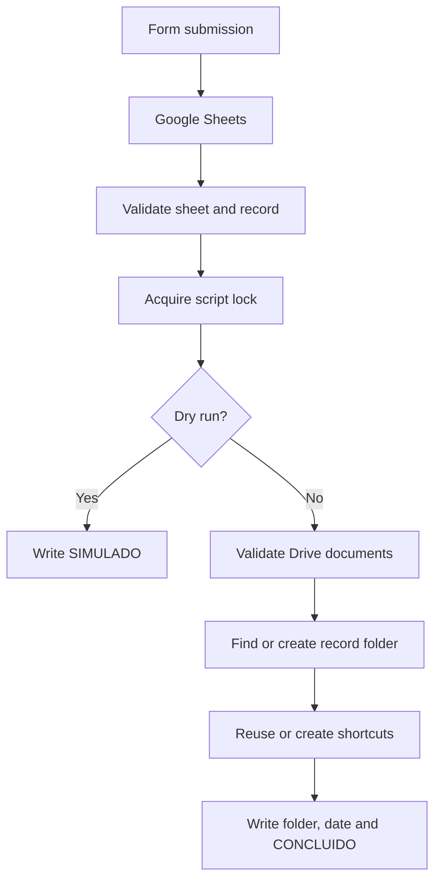

# HR Admission Document Automation

A public reconstruction of a Google Workspace automation built to organize documents from an HR admission workflow.

The challenge was not simply creating folders in Google Drive. The workflow needed to remain predictable across repeated executions, partial failures and concurrent runs — without moving original documents or exposing sensitive information through errors and logs.

This repository recreates those problems with synthetic records and dedicated test environments.

<p>
  
  
  
</p>

---

## Context

The original workflow involved collecting admission documents and organizing them into a consistent structure inside Google Workspace.

The reconstructed flow is:

```text
Google Forms
     │
     ▼
Google Sheets
     │
     ▼
Google Apps Script
     │
     ▼
Google Drive
```

A form submission becomes a spreadsheet record. The script validates that record, organizes its related documents and writes the processing result back to the sheet.

> [!NOTE]
> This repository is a sanitized public reconstruction.
>
> It contains no real employee data, company credentials, private Drive IDs, internal documents or production configuration.

---

## What made this tricky

### Idempotent organization

Repeated execution should not create a new folder or duplicate shortcuts every time the same record is processed.

Each admission uses a stable identifier such as `DEMO-001`.

The automation searches for the corresponding folder, reuses it when there is exactly one match and only creates shortcuts for documents that are not already represented there.

If multiple matching folders exist, the workflow stops rather than choosing one arbitrarily.

### Partial failure recovery

Google Drive operations are not an atomic transaction.

A run can fail after one shortcut has already been created but before the workflow is complete.

Instead of attempting to roll everything back, the next execution inspects the existing folder and shortcuts, preserves completed work and creates only what is still missing.

### Safe simulation

`DRY_RUN` is enabled by default.

In simulation mode the workflow validates the spreadsheet record and writes:

```text
SIMULADO
```

without accessing Google Drive.

Only the explicit value:

```text
DRY_RUN=false
```

enables Drive operations.

### Concurrency protection

The script uses `LockService` to serialize executions inside the same Apps Script project.

If the lock cannot be acquired, the process stops without mutating the record or accessing Drive.

This prevents two executions of the same project from processing the workflow simultaneously.

### Controlled errors

Raw service errors can contain information that should not be written back to a spreadsheet or exposed publicly.

Processing failures are therefore converted to a controlled message:

```text
PROCESSAMENTO_FALHOU: revise configuracao, dados e permissoes no ambiente de teste.
```

The spreadsheet receives a generic:

```text
ERRO_REVISAR
```

when the workflow has progressed far enough to safely identify the status column.

---

## Workflow



The public implementation validates:

- the configured sheet
- row boundaries
- required and unique headers
- stable demo record IDs
- synthetic names
- supported Google Drive URLs
- duplicate records
- duplicate document IDs
- inaccessible or trashed resources
- ambiguous folders

Formulas inside the `Documentos` field are rejected before Drive operations.

---

## Document handling

The automation intentionally does not move or copy the original documents.

Instead, it creates Google Drive shortcuts inside the admission folder.

```text
Original documents
       │
       ├─────────────┐
       │             │
       ▼             ▼
Existing location   HR demo folder
                    ├── Shortcut A
                    └── Shortcut B
```

This keeps the source documents in their original locations while providing an organized view for the workflow.

---

## Tests

The repository includes automated tests using simulated Google services.

Run them with:

```bash
node --test tests/demo.test.cjs
```

Current validation:

- **16 automated tests**
- simulation without Drive access
- repeated execution without duplicate folders or shortcuts
- partial failure recovery
- duplicate record rejection
- unsupported URL rejection
- formula rejection
- ambiguous folder handling
- inaccessible document handling
- lock contention
- sanitized error behavior
- form-submit event handling
- flush and lock-release behavior

The automated suite does not require Google credentials.

> [!NOTE]
> These tests simulate Google services. They validate the workflow logic but do not replace testing inside an actual Google Workspace environment.

---

## Google Workspace validation

Part of the workflow has also been exercised in a real Google test environment using synthetic data and private test resources.

The validation work covers Google Sheets, Apps Script and Drive behavior such as folder creation, shortcut handling and repeated execution.

Some scenarios remain intentionally documented as pending rather than being presented as validated.

The complete validation scope, evidence rules and pending scenarios are documented in:

[Google Workspace validation](docs/validacao-google.md)

The full **Forms → Sheets trigger → Apps Script → Drive** workflow is not claimed as completely validated end-to-end.

---

## Running in a test environment

Use only a dedicated test environment with synthetic documents.

### 1. Prepare the spreadsheet

Create a private Google Sheet and import:

```text
examples/respostas-demo.csv
```

Use:

```text
Respostas Demo
```

as the sheet name.

### 2. Add the Apps Script

Open:

```text
Extensions → Apps Script
```

and copy:

```text
src/Code.gs
```

into the project.

### 3. Configure Script Properties

Configure:

```text
SHEET_NAME=Respostas Demo
ROOT_FOLDER_ID=YOUR_TEST_FOLDER_ID
DRY_RUN=true
```

Keep real folder IDs only inside the private Apps Script configuration.

### 4. Test simulation mode

Select a demo row and run:

```text
Admissoes Demo → Processar linha selecionada
```

The expected status is:

```text
SIMULADO
```

The script does not access Drive in this execution path.

### 5. Test Drive operations

Use a dedicated private folder containing synthetic test files.

Then explicitly configure:

```text
DRY_RUN=false
```

A successful execution can create or reuse the record folder, create missing shortcuts and update the spreadsheet with the folder URL, processing date and:

```text
CONCLUIDO
```

---

## Project structure

```text
src/
└── Code.gs

examples/
├── respostas-demo.csv
└── README.md

docs/
├── fluxo.md
└── validacao-google.md

tests/
└── demo.test.cjs

.github/
└── workflows/
    └── tests.yml
```

---

## Public reconstruction

The public repository intentionally preserves the workflow and engineering decisions rather than the original operational environment.

It contains no:

- real employee or candidate information
- private Drive URLs
- production folder IDs
- company credentials
- internal documents
- production configuration

The script also does not:

- change sharing permissions
- send emails
- move original files
- delete original files
- log document contents

All examples and records are synthetic.

---

## Limits

This project is a demonstration of the workflow and its engineering decisions, not a production-ready HR platform.

It does not provide guarantees for:

- atomic transactions between Sheets and Drive
- failures caused by external concurrent projects
- Google service outages
- quota exhaustion
- malware scanning
- document-content validation
- consent management
- retention policies
- large-scale queue processing
- Shared Drive behavior

Google permissions and service quotas still apply.

---

## Documentation

- [Workflow and failure recovery](docs/fluxo.md)
- [Google Workspace validation](docs/validacao-google.md)
- [Demo examples](examples/README.md)

---

## License

Available under the [MIT License](LICENSE).
