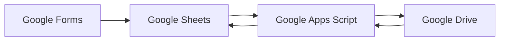

<div align="center">

# HR Admission Document Automation

**Google Workspace automation for organizing admission documents, tracking processing status, and creating structured Drive folders from form responses.**

<p>
  
  
  
  
</p>

</div>

---

## 🚀 Overview

This project is a sanitized public reconstruction of an HR admission document workflow built with the Google Workspace ecosystem.

It demonstrates how form responses can be transformed into an organized and traceable document workflow using:

**Google Forms → Google Sheets → Google Apps Script → Google Drive**

The automation can:

- validate admission records
- organize documents by stable record ID
- create or reuse Drive folders
- create shortcuts to existing files
- update processing status in Sheets
- safely resume after partial failures
- prevent concurrent execution inside the same Apps Script project

> [!IMPORTANT]
> This repository does **not** contain production code, real employee data, company credentials, private Drive IDs, or internal documents.
>
> All examples and records are synthetic.

---

## ✨ Key Features

### 📄 Document Organization

- Processes admission records from Google Sheets
- Creates one Drive folder per stable record
- Uses shortcuts instead of moving or copying original files
- Preserves original document locations

### 🔁 Idempotency & Recovery

- Reuses existing folders on repeated executions
- Reuses existing shortcuts when possible
- Supports recovery after partial failures
- Avoids blindly recreating resources

### 🛡️ Safe-by-Default Execution

- `DRY_RUN=true` by default
- Simulation mode does not access Google Drive
- Real Drive operations require explicit configuration
- Errors are sanitized before being written to logs or status fields

### 🔒 Concurrency Protection

- Uses Apps Script locking mechanisms
- Prevents simultaneous processing inside the same script project
- Validates headers and records before writing results

---

## 🏗️ Architecture



### Workflow

```text
Form Submission
      │
      ▼
Google Sheets
      │
      ▼
Validation & Lock
      │
      ▼
Dry Run?
 ┌────┴────┐
 │         │
Yes       No
 │         │
 ▼         ▼
SIMULATED  Drive Folder / Shortcuts
 │         │
 └────┬────┘
      ▼
Status written to Sheets
```

The automation uses a stable record identifier such as `DEMO-001` rather than a person's name as the folder key.

---

## 🧪 Testing

The repository includes automated tests using simulated Google services.

```bash
node --test tests/demo.test.cjs
```

### Current validation

- **16 automated tests**
- CI with GitHub Actions
- idempotency scenarios
- partial failure recovery
- duplicate record validation
- unsupported URL validation
- concurrency-related behavior
- dry-run behavior

The CI runs without Google credentials.

> [!NOTE]
> Automated tests use simulated services and do not replace validation inside a real Google Workspace test environment.

---

## ☁️ Google Workspace Validation

A partial validation was also performed in a real Google environment using synthetic data.

The validated flow includes:

- Google Sheets
- Apps Script
- private test folders in Google Drive
- synthetic documents
- folder creation
- shortcut creation
- repeated execution and reuse behavior

The full Forms → Sheets trigger flow is not presented as fully validated end-to-end.

See:

[📋 Google Validation](docs/validacao-google.md)

---

## 🔒 Security & Privacy

The public demo was designed to avoid exposing information from the original business process.

It contains:

- no real employee data
- no candidate names or emails
- no private Drive URLs
- no production folder IDs
- no company credentials
- no internal documents
- no external services

The script does not:

- change sharing permissions
- send emails
- move or delete original files
- log document contents

Script properties are kept outside the public source code, but they should **not** be treated as a secure secrets vault.

> Use only dedicated test accounts, private test folders, and synthetic files when reproducing this demo.

---

## ▶️ Running in a Test Environment

### 1. Prepare Google Sheets

Create a new private spreadsheet and import:

```text
examples/respostas-demo.csv
```

Use the sheet name:

```text
Respostas Demo
```

### 2. Add the Apps Script

Open:

```text
Extensions → Apps Script
```

Copy:

```text
src/Code.gs
```

into the Apps Script editor.

### 3. Configure Script Properties

```text
SHEET_NAME=Respostas Demo
ROOT_FOLDER_ID=YOUR_TEST_FOLDER_ID
DRY_RUN=true
```

### 4. Run in Simulation Mode

Select a demo row and run:

```text
Admissoes Demo → Processar linha selecionada
```

Expected result:

```text
SIMULADO
```

No Drive folder is created while `DRY_RUN=true`.

### 5. Enable Drive Testing

Use a private test folder with synthetic files only.

Then change:

```text
DRY_RUN=false
```

A successful execution should create or reuse the demo folder and update the processing status in the spreadsheet.

---

## 📁 Project Structure

```text
src/
└── Code.gs

examples/
├── respostas-demo.csv
└── README.md

docs/
├── fluxo.md
└── validacao-google.md

tests/
└── demo.test.cjs

.github/
└── workflows/
    └── tests.yml
```

---

## 📚 Documentation

More details are available in:

- [🔄 Workflow & Failure Scenarios](docs/fluxo.md)
- [☁️ Google Environment Validation](docs/validacao-google.md)
- [🧪 Demo Examples](examples/README.md)

---

## ⚠️ Limitations

This project is a portfolio reconstruction and is not production-ready.

It does not provide:

- atomic transactions between Sheets and Drive
- automatic retries
- document validation
- malware scanning
- admission decision logic
- consent management
- retention policies
- large-scale queue processing
- Shared Drive optimization

Google quotas and permissions still apply.

---

## 📄 License

This project is available under the [MIT License](LICENSE).
