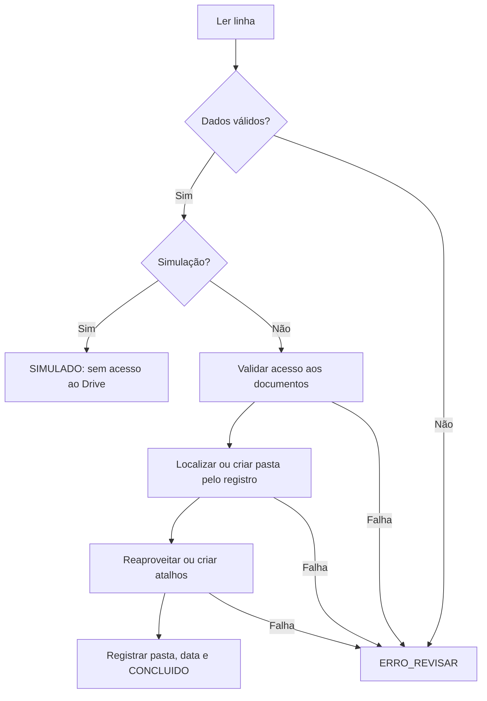

# Fluxo e recuperação

1. O Forms registra uma resposta na planilha. O CSV permite demonstrar o mesmo fluxo sem formulário.
2. O gatilho fornece a linha; a execução manual usa a seleção atual.
3. O script verifica aba e limites, obtém um bloqueio e valida cabeçalhos únicos.
4. Lê o registro, exige nome fictício e chave `DEMO-` numérica, interpreta links e rejeita registros duplicados.
5. Em simulação, registra `SIMULADO` e termina sem consultar Drive.
6. Na execução real, verifica acesso aos documentos e procura a pasta diretamente dentro da raiz de teste.
7. Cria a pasta somente se ausente. Se houver mais de uma correspondência, interrompe.
8. Examina IDs de destino dos atalhos existentes e cria somente os ausentes.
9. Escreve URL da pasta, data e `CONCLUIDO`; libera o bloqueio mesmo quando ocorre erro.

## Garantias e limites

Idempotência é baseada em registro estável, pasta preservada e atalhos com IDs de destino. Reexecutar com os mesmos dados não deve criar novas pastas nem atalhos. O horário representa a última execução bem-sucedida, portanto pode mudar. Não se ignora uma linha apenas pelo status: isso permite recuperar falhas parciais.

Uma falha após criar um atalho não desfaz a criação. A próxima execução consulta os atalhos novamente. Não há rollback nem garantia de exatamente uma execução em presença de outros projetos ou mudanças manuais. O bloqueio só serializa execuções deste projeto.

## Roteiro de aceitação no Google

| Cenário | Resultado esperado |
| --- | --- |
| CSV sem documentos, simulação | SIMULADO; sem pasta e sem data nova |
| Execução real com arquivo sintético | Pasta pelo registro e um atalho |
| Mesma linha executada duas vezes | Mesma URL, mesma quantidade de pastas/atalhos |
| Dois links para o mesmo arquivo | Um único atalho |
| Acrescentar outro arquivo | Apenas um novo atalho |
| Registro duplicado ou URL externa | ERRO_REVISAR, sem novos itens no Drive |
| Arquivo inacessível | ERRO_REVISAR; verifique permissões na conta de teste |
| Duas pastas com mesmo registro | ERRO_REVISAR; resolver ambiguidade manualmente |
| Gatilho Forms pela planilha | Processa a linha recebida, não a última linha arbitrária |

Não execute testes com documentos reais. Verifique manualmente o compartilhamento da raiz e da planilha antes de ativar a escrita no Drive. Use uma planilha separada, conta dedicada e arquivos cujo conteúdo seja explicitamente fictício.
